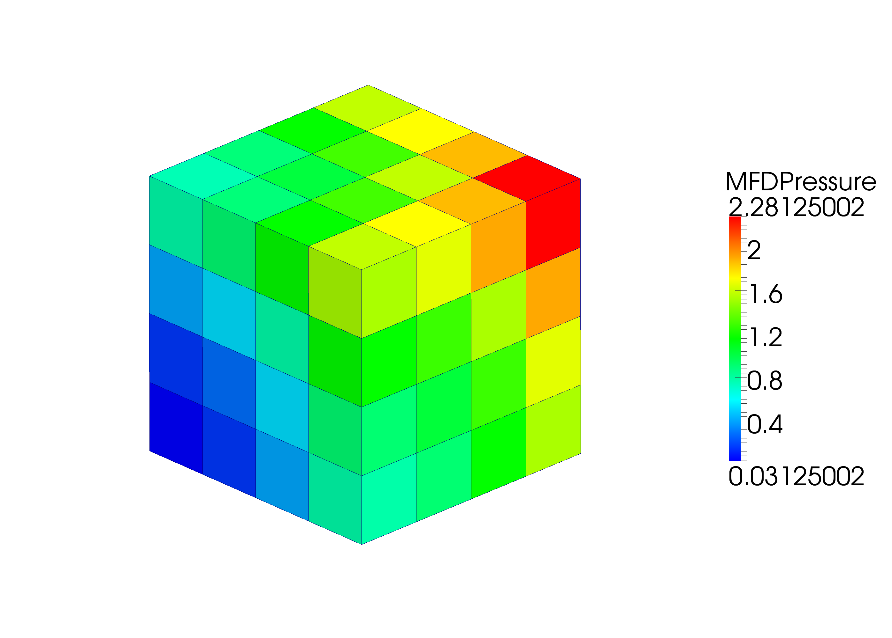

=====
mimpy
=====

Mimpy is a Python based library for solving elliptic PDE using the Mimetic Finite 
Difference Method. Most numerical codes are limited to tetrahedral or hexahedral 
meshes. The advantage of mimpy is the ability to naturally solve over a very general set of 
of three dimensional polyhedral meshes.

The best way to get the code right now is to clone the git repo and run the setup utility:

    .. code-block:: bash
    
        $ git clone https://github.com/ohinai/pas.git
        $ python setup.py install 

An simple example of using the code can be found in (examples/hexmesh/example1/hexmesh_example_1.py).
Run:

    .. code-block:: bash
    
        $ python hexmesh_example_1.py 

If all goes well, you should get a file named (hexmesh_example_1.vtk). Open the file using 
Paraview and plot "MFDPressure." You should see something like this:

Congratulations! You've just approximated the solution to a Partial Differential Equation using the 
Mimetic Finite Difference method. 

