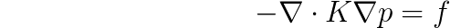
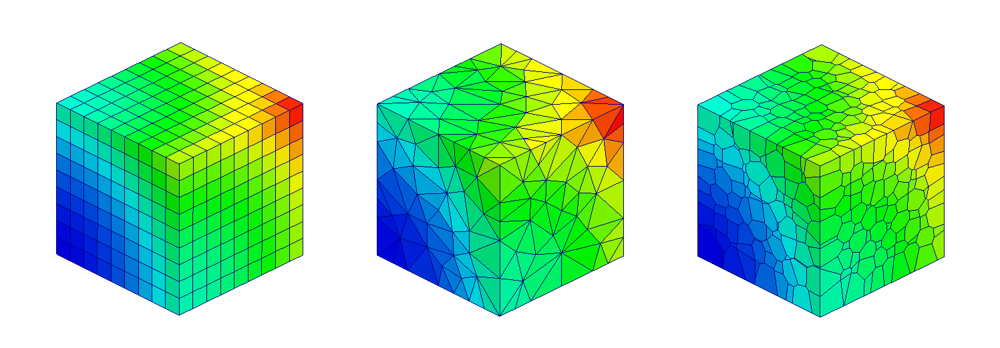

=====
mimpy
=====

.. image:: https://api.travis-ci.org/ohinai/mimpy.png?branch=master
    :target: https://travis-ci.org/ohinai/mimpy

Mimpy is a Python based library for solving
the diffusion equation:

Diffusion is a "kernel" problem for lots of physical phenomena, like heat and 
underground fluid flow. 

Mimpy is based on the Mimetic Finite Difference method, which allows 
it to solve over general polyhedral elements. That includes hexahedra, 
tetrahedra and Voronoi elements:

The best way to get the code right now is to clone the git repo and run the setup utility:

    .. code-block:: bash
    
        $ git clone https://github.com/ohinai/mimpy.git
        $ python setup.py install 

An simple example of using the code can be found in (examples/hexmesh/example1/hexmesh_example_1.py).
Run:

    .. code-block:: bash
    
        $ python hexmesh_example_1.py 

If all goes well, you should get a file named (hexmesh_example_1.vtk). Open the file using 
Paraview and plot "MFDPressure." You should see something like this:

.. image:: hexmesh_solution.png

